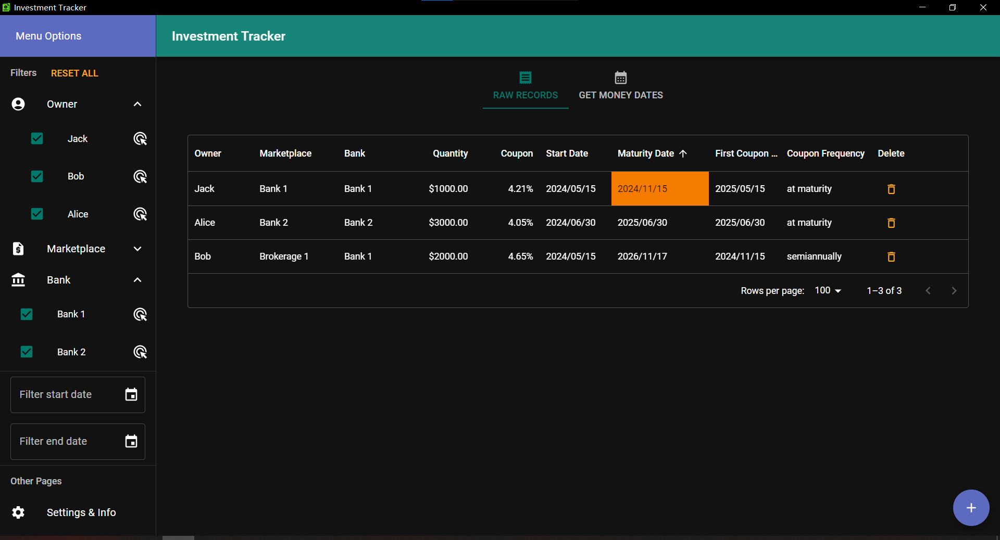
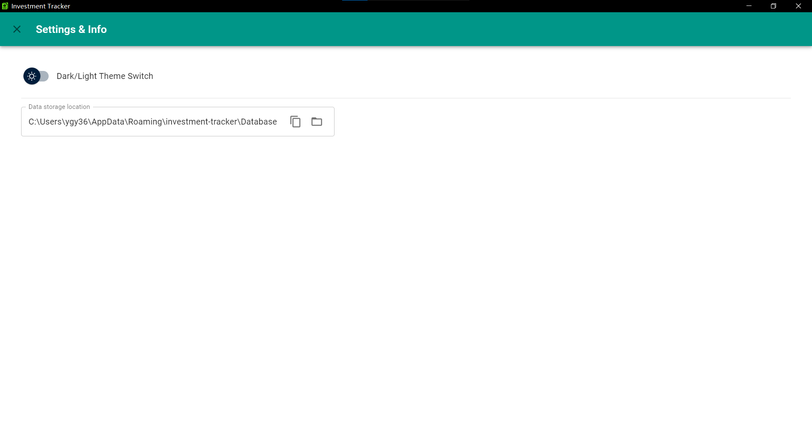
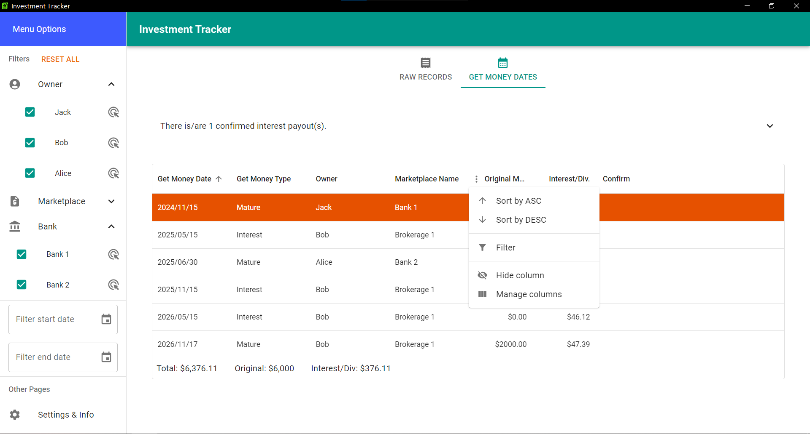

 
A free & open-source software for tracking fixed-income investments, and could provide earning date tracking and earning value estimate.
 
Made by <a href="https://github.com/BenjaminYe36">Guangyin Ye</a>

[comment]: <> (The start of badges part)

## Changes & Features
- Polished up for a public release v1.5.0
- Quick filtering by owner, marketplace, bank, and start & end time within the side drawer
- Interactive data grid (edit, delete, hide, sort, filter) to show the records
- Autocomplete based on current records when adding new records
- Highlight for already past maturity records, and most recent get money date
- Earning estimates
- Auto theme (Light/Dark) based on system preferences, and can be changed in settings

## Screenshots

  
  
  
  
  
  

## Download page
[See release here](https://github.com/BenjaminYe36/investment-tracker/releases)

## User Guide
- Coming soon

## Testing & Building
### Pre-req for testing

- Rust & System specific pre-req ([please view Tauri doc here](https://tauri.app/v1/guides/getting-started/prerequisites))
- NodeJs & npm

### Testing instructions
1. git clone this repo or download source code and extract
2. install Tauri pre-req by following [this guide](https://tauri.app/v1/guides/getting-started/prerequisites)
3. run `npm install` under project folder
4. run `npm run tauri dev` for dev build testing

### Building
run command `npm run tauri build` for creating distribution for your platform

## Many Thanks to Tauri, MUI and their documentation

- You could learn more about Tauri [here](https://tauri.app/)
- You could learn more about MUI [here](https://mui.com/)
